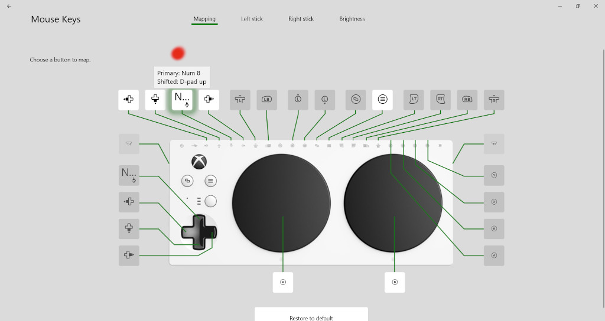
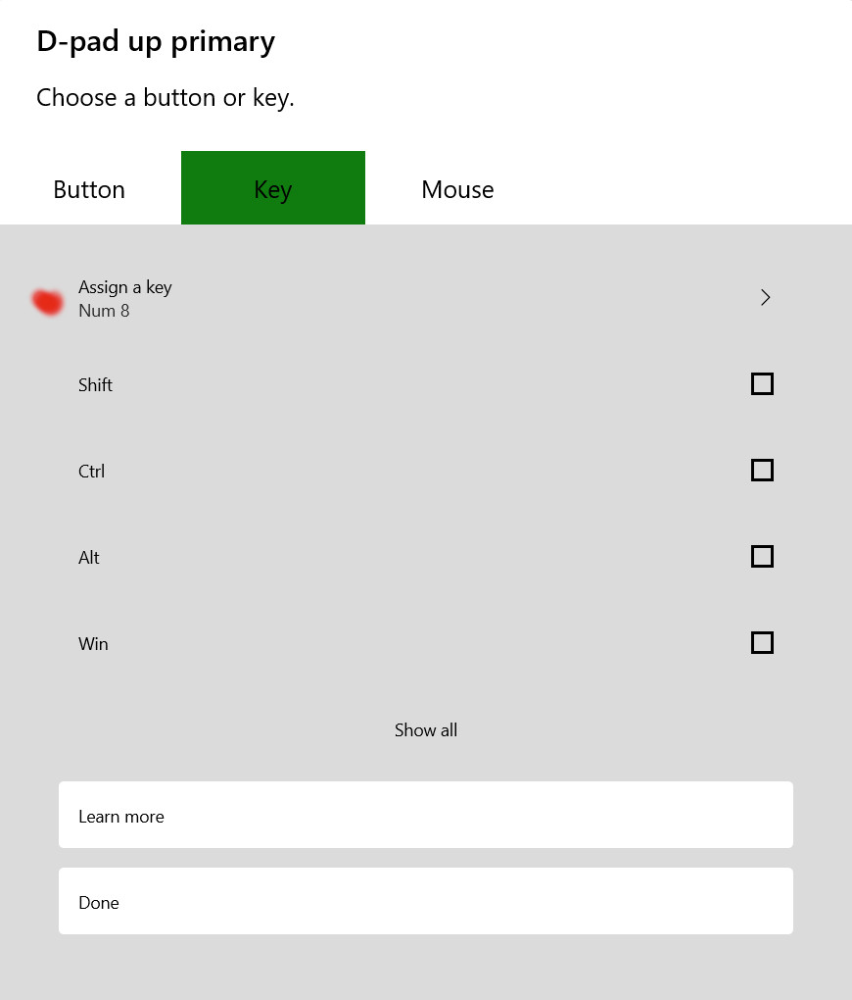

# Xbox Adaptive Controller Tricks

## Move Mouse Pointer using AT Switch/Buttons

The Windows Mouse Keys feature lets the user move the mouse pointer using
the numeric keypad keys. The XAC can send keyboard key presses including
the numeric keypad keys. Combining these features allows the user to
move the mouse pointer using AT switches/buttons plugged into the XAC.

### Turn Num Lock On

### Configure XAC

Turn off Mouse Keys during this step. In Setting | Accessibility | Mouse. Or
search for "mouse keys".

Create profile named "Mouse Keys".

Configure Dpad Up to send Keyboard Numpad 8.

Assign the profile to a slot. I chose slot 3.

### Turn on Mouse Keys

In Setting | Accessibility | Mouse. Or search for "mouse keys".

### Plug in AT Switch/Button to Dpad Up input jack

Press the XAC profile button to select profile 3.

Press the button to move the mouse pointer. Or press the XAC Dpad up.

### Configure more input jacks for Dpad left, right, and down.

## Convert XAC Joystick to Mouse

https://github.com/controllercustom/XAC_mouse

